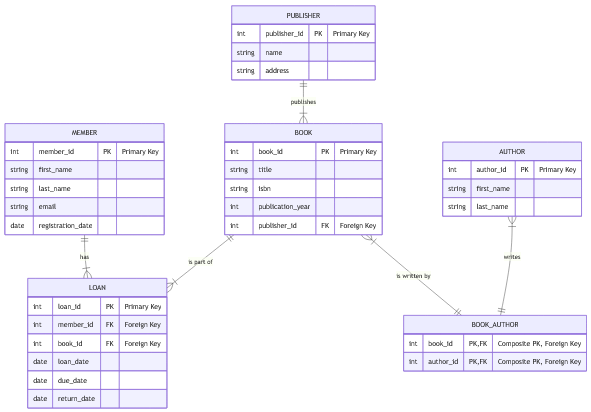

# Lab 1
## ER-діаграми
### Нотація Чена

### Воронячі лапки

### Діаграма декларативного синтаксису

### Модель у середовищі програмування
```
from dataclasses import dataclass
from datetime import date
from typing import Optional

@dataclass
class Publisher:
    publisher_id: int
    name: str
    address: str

@dataclass
class Author:
    author_id: int
    first_name: str
    last_name: str

@dataclass
class Book:
    book_id: int
    title: str
    isbn: str
    publication_year: int
    publisher_id: int

@dataclass
class Member:
    member_id: int
    first_name: str
    last_name: str
    email: str
    registration_date: date

@dataclass
class Loan:
    loan_id: int
    member_id: int
    book_id: int
    loan_date: date
    due_date: date
    return_date: Optional[date] = None

@dataclass
class BookAuthor:
    book_id: int
    author_id: int

publisher = Publisher(publisher_id=1, name="Видавництво Старого Лева", address="м. Львів, вул. Галицька, 1")

author1 = Author(author_id=10, first_name="Іван", last_name="Франко")
author2 = Author(author_id=11, first_name="Леся", last_name="Українка")

book = Book(
    book_id=101,
    title="Зів'яле листя",
    isbn="978-617-679-111-0",
    publication_year=1896,
    publisher_id=publisher.publisher_id
)

book_author_link = BookAuthor(book_id=book.book_id, author_id=author1.author_id)

member = Member(
    member_id=501,
    first_name="Олена",
    last_name="Пчілка",
    email="olena.pchilka@example.com",
    registration_date=date(2024, 10, 26)
)

loan = Loan(
    loan_id=1001,
    member_id=member.member_id,
    book_id=book.book_id,
    loan_date=date.today(),
    due_date=date(2025, 11, 9)
)

print("Видавець:")
print(publisher)

print("\nАвтор:")
print(author1)

print("\nКнига:")
print(book)
print(f"(Зв'язок: ID видавця цієї книги - {book.publisher_id})")


print("\nЧитач:")
print(member)

print("\nВидача:")
print(loan)
print(f"(Зв'язок: Цю видачу здійснив читач з ID {loan.member_id} для книги з ID {loan.book_id})")

input("\nEnter")
```