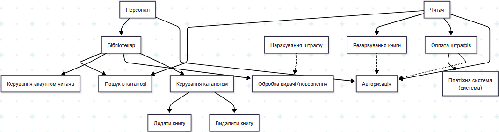

# Lab 2
## Use Case Diagram
### Графічний варіант

### Декларативний опис у вигляді коду
```
flowchart TD
    reader["Читач"]
    staff["Персонал"]
    librarian["Бібліотекар"]
    
    paymentSystem["Платіжна система<br/>(система)"]

    UC_Login["Авторизація"]
    UC_Search["Пошук в каталозі"]
    UC_Reserve["Резервування книги"]
    UC_PayFine["Оплата штрафів"]
    UC_ManageUser["Керування акаунтом читача"]
    UC_ProcessReturn["Обробка видачі/повернення"]
    UC_CalcFine["Нарахування штрафу"]
    UC_ManageCatalog["Керування каталогом"]
    UC_AddBook["Додати книгу"]
    UC_RemoveBook["Видалити книгу"]
    
    staff --> librarian

    reader --> UC_Search
    reader --> UC_Reserve
    reader --> UC_PayFine
    reader --> UC_Login
    
    staff --> UC_Login
    librarian --> UC_Search
    librarian --> UC_ManageUser
    librarian --> UC_ProcessReturn
    librarian --> UC_ManageCatalog

    UC_PayFine --> paymentSystem
    
    UC_Reserve -.-> UC_Login
    UC_PayFine -.-> UC_Login
    
    UC_CalcFine -.-> UC_ProcessReturn
    
    UC_ManageCatalog --> UC_AddBook
    UC_ManageCatalog --> UC_RemoveBook
```
## Список вимог
### Functional
| ID | Вимога |
| :---: | :--- |
| **1** | Система повинна дозволяти користувачам (читачам та персоналу) шукати книги в каталозі за назвою, автором або ISBN. |
| **2** | Зареєстровані читачі повинні мати можливість авторизуватися в системі. |
| **3** | Авторизовані читачі повинні мати можливість резервувати книги. |
| **4** | Авторизовані читачі повинні мати можливість оплатити наявні штрафи. |
| **5** | Персонал повинен мати можливість реєструвати нових читачів у системі. |
| **6** | Персонал повинен мати можливість переглядати профіль читача, включно з його історією видач. |
| **7** | Персонал повинен мати можливість оформлювати видачу книг читачеві. |
| **8** | Персонал повинен мати можливість оформлювати повернення книг від читача. |
| **9** | Система повинна автоматично розраховувати штраф, якщо книга повертається із запізненням. |
| **10** | Персонал повинен мати можливість додавати нові примірники книг до каталогу. |
| **11** | Персонал повинен мати можливість видаляти/списувати примірники книг з каталогу. |
### Non Functional
| ID | Вимога |
| :---: | :--- |
| **1** | Час відповіді системи на пошуковий запит не повинен перевищувати 2 секунди.
| **2** | Усі фінансові транзакції повинні відбуватися через захищений шлюз (SSL/TLS).
| **3** | Система повинна інтегруватися із зовнішньою платіжною системою для обробки платежів.
## Матриця трасування
| Вимога | Пов'язаний Use Case | Примітки |
| :--- | :--- | :--- |
| **1** Пошук книги | `UC_Search (Пошук в каталозі)` | |
| **2** Авторизація читача | `UC_Login (Авторизація)` | |
| **3** Резервування книги | `UC_Reserve (Резервування книги)` | |
| **4** Оплата штрафів | `UC_PayFine (Оплата штрафів)` | |
| **5** Реєстрація читачів | `UC_ManageUser (Керування акаунтом)` | Багато-до-одного (UC покриває FR5, FR6) |
| **6** Перегляд профілю/історії | `UC_ManageUser (Керування акаунтом)` | Багато-до-одного (UC покриває FR5, FR6) |
| **7** Видача книги | `UC_ProcessReturn (Обробка видачі/повернення)` | Багато-до-одного (UC покриває FR7, FR8) |
| **8** Повернення книги | `UC_ProcessReturn (Обробка видачі/повернення)` | Багато-до-одного (UC покриває FR7, FR8) |
| **9** Розрахунок штрафу | `UC_CalcFine (Нарахування штрафу)` | |
| **10** Додавання книг | `UC_AddBook (Додати книгу)` | |
| **11** Видалення книг | `UC_RemoveBook (Видалити книгу)` | |
| **(UC без вимоги)** | `UC_ManageCatalog (Керування каталогом)` | **Обґрунтування:** Це абстрактний (базовий) UC. |