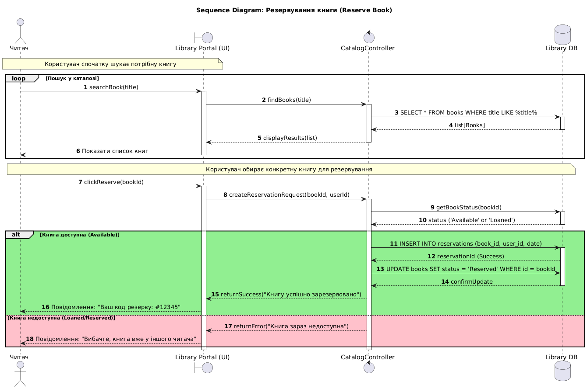

# Lab 3
## Діаграма послідновностей
### Графічний варіант

### Декларативний опис у вигляді коду
```
@startuml
skinparam sequenceMessageAlign center
autonumber

actor "Читач" as User
boundary "Library Portal (UI)" as UI
control "CatalogController" as Ctrl
database "Library DB" as DB

title Sequence Diagram: Резервування книги (Reserve Book)

note over User, UI: Користувач спочатку шукає потрібну книгу
loop Пошук у каталозі
    User -> UI: searchBook(title)
    activate UI
    UI -> Ctrl: findBooks(title)
    activate Ctrl
    Ctrl -> DB: SELECT * FROM books WHERE title LIKE %title%
    activate DB
    DB --> Ctrl: list[Books]
    deactivate DB
    Ctrl --> UI: displayResults(list)
    deactivate Ctrl
    UI --> User: Показати список книг
    deactivate UI
end

note over User, DB: Користувач обирає конкретну книгу для резервування

User -> UI: clickReserve(bookId)
activate UI
UI -> Ctrl: createReservationRequest(bookId, userId)
activate Ctrl

    Ctrl -> DB: getBookStatus(bookId)
    activate DB
    DB --> Ctrl: status ('Available' or 'Loaned')
    deactivate DB

    alt #LightGreen Книга доступна (Available)
        Ctrl -> DB: INSERT INTO reservations (book_id, user_id, date)
        activate DB
        DB --> Ctrl: reservationId (Success)
        
        Ctrl -> DB: UPDATE books SET status = 'Reserved' WHERE id = bookId
        DB --> Ctrl: confirmUpdate
        deactivate DB

        Ctrl --> UI: returnSuccess("Книгу успішно зарезервовано")
        UI --> User: Повідомлення: "Ваш код резерву: #12345"

    else #Pink Книга недоступна (Loaned/Reserved)
        Ctrl --> UI: returnError("Книга зараз недоступна")
        UI --> User: Повідомлення: "Вибачте, книга вже у іншого читача"
    end

deactivate Ctrl
deactivate UI

@enduml
```