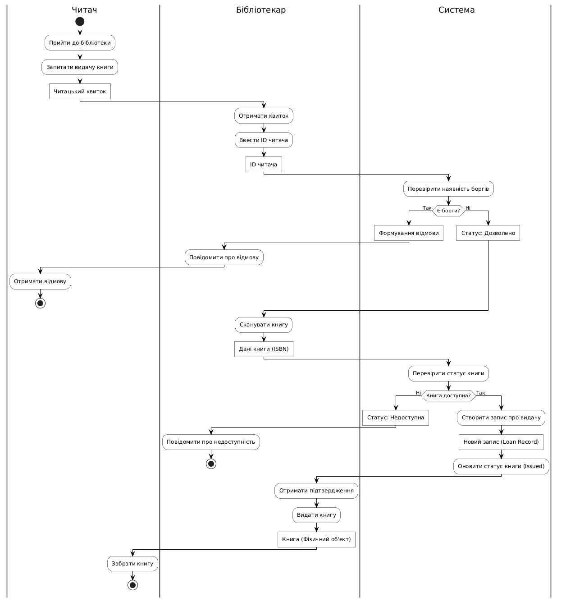
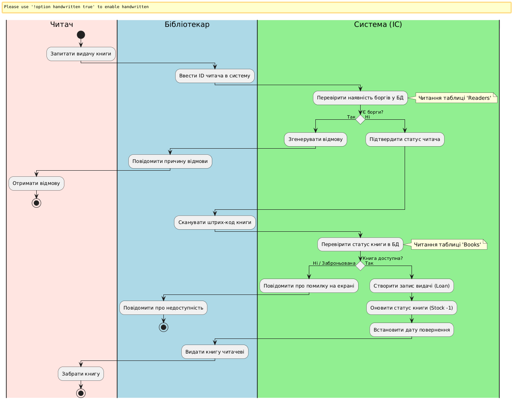

# Lab 4
## Activity Diagram
### Графічний варіант

### Декларативний опис у вигляді коду
```
@startuml
skinparam ActivityBackgroundColor #FEFECE
skinparam ActivityBorderColor black

|Читач|
start
:Запитати книгу для видачі;

|Бібліотекар|
:Отримати читацький квиток та книгу;
:Ввести ID читача в систему;

|Система|
:Перевірити статус читача;
note right: Звернення до сутності "Reader"

if (Є активні борги або штрафи?) then (Так)
  |Система|
  :Повернути повідомлення про відмову;
  |Бібліотекар|
  :Повідомити причину відмови;
  |Читач|
  :Отримати відмову;
  stop
else (Ні)
  |Система|
  :Дозволити операцію;
endif

|Бібліотекар|
:Сканувати код книги;

|Система|
:Перевірити статус книги;
note right: Звернення до сутності "Book"

if (Книга доступна?) then (Ні / Заброньована)
  :Повідомити про недоступність;
  stop
else (Так)
  :Створити запис про видачу (Loan);
  :Оновити статус книги на "Видана";
  :Встановити дату повернення;
endif

|Бібліотекар|
:Передати книгу читачеві;

|Читач|
:Отримати книгу;
stop

@enduml
```
## BPMN Diagram
### Графічний варіант 
